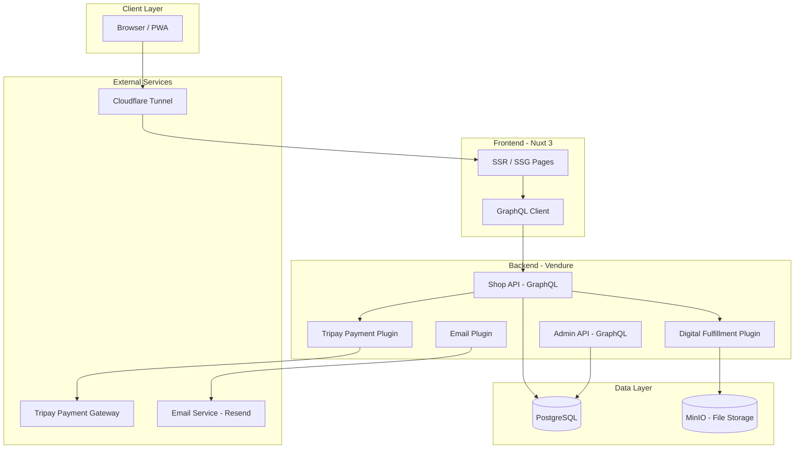
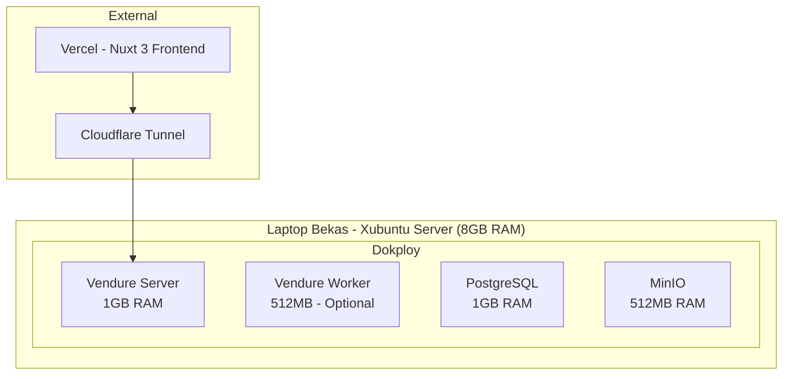
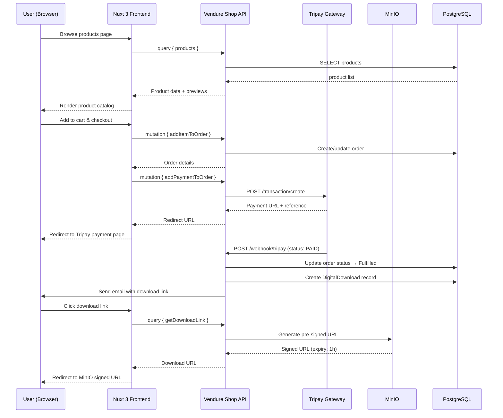
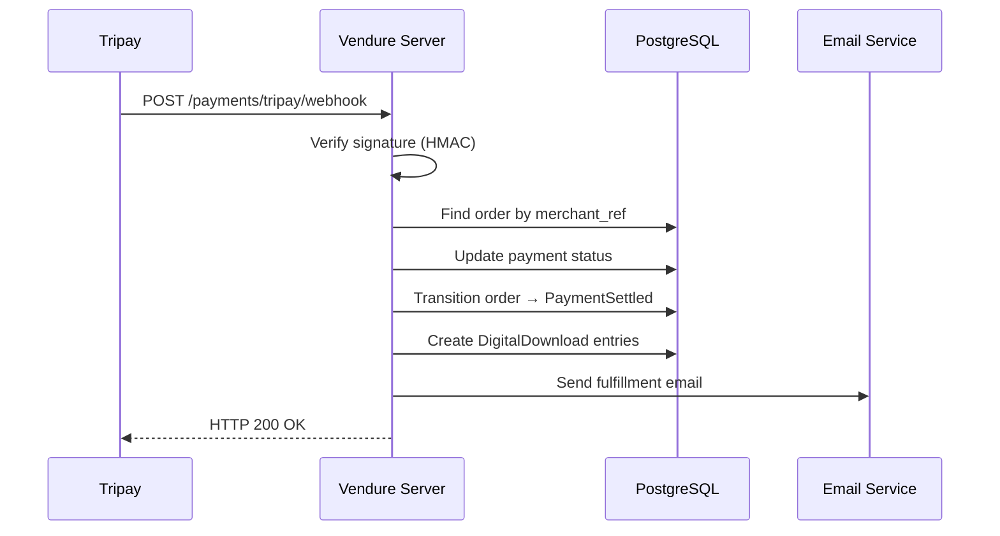

# Design Document: NgopiCode Digital Store

## Overview

NgopiCode Digital Store adalah platform e-commerce headless untuk menjual produk digital (source code, ebook, template) kepada developer Indonesia. Platform ini dibangun menggunakan Vendure (NestJS + TypeScript) sebagai backend dengan custom plugins untuk payment (Tripay), digital fulfillment, dan email notification. Frontend menggunakan Nuxt 3 dengan GraphQL untuk komunikasi ke backend.

MVP fokus pada happy path utama: browse produk → checkout → pembayaran via Tripay → download produk digital. Sistem di-deploy secara self-hosted menggunakan Dokploy pada hardware terbatas (8GB RAM), sehingga arsitektur harus efisien dalam penggunaan resource.

Pendekatan headless commerce memungkinkan frontend dan backend berkembang secara independen, dengan GraphQL API sebagai kontrak antara keduanya. Custom plugins di Vendure menangani logika bisnis spesifik untuk produk digital dan payment gateway lokal Indonesia.

## Architecture

### System Overview



### Deployment Architecture



## Sequence Diagrams

### Main Flow: Browse → Checkout → Payment → Download



### Tripay Webhook Flow



## Components and Interfaces

### Component 1: Tripay Payment Plugin

**Purpose**: Mengintegrasikan Vendure dengan Tripay payment gateway untuk menerima pembayaran dari berbagai metode (bank transfer, e-wallet, QRIS) yang populer di Indonesia.

**Interface**:

```typescript
// tripay-payment-plugin/src/types.ts
interface TripayPluginOptions {
  apiKey: string;
  privateKey: string;
  merchantCode: string;
  sandbox: boolean;
  callbackUrl: string;
  returnUrl: string;
  allowedChannels: TripayChannel[];
}

interface TripayChannel {
  code: string;       // e.g., 'BRIVA', 'QRIS', 'OVO'
  name: string;
  group: 'bank_transfer' | 'ewallet' | 'qris' | 'retail';
  active: boolean;
}

interface TripayCreateTransactionInput {
  method: string;
  merchant_ref: string;
  amount: number;
  customer_name: string;
  customer_email: string;
  order_items: TripayOrderItem[];
}

interface TripayCreateTransactionResponse {
  success: boolean;
  data: {
    reference: string;
    merchant_ref: string;
    payment_url: string;
    amount: number;
    status: 'UNPAID' | 'PAID' | 'EXPIRED' | 'FAILED';
    expired_time: number;
  };
}

interface TripayWebhookPayload {
  reference: string;
  merchant_ref: string;
  payment_method: string;
  payment_method_code: string;
  total_amount: number;
  fee_merchant: number;
  fee_customer: number;
  total_fee: number;
  amount_received: number;
  status: 'PAID' | 'EXPIRED' | 'FAILED';
  paid_at: string;
}
```

**Responsibilities**:
- Membuat transaksi pembayaran di Tripay saat checkout
- Memverifikasi webhook signature menggunakan HMAC SHA256
- Mengupdate status order di Vendure setelah pembayaran berhasil
- Menangani expiry dan failed payment

### Component 2: Digital Fulfillment Plugin

**Purpose**: Mengelola lifecycle produk digital mulai dari upload file, penyimpanan di MinIO, hingga secure download menggunakan pre-signed URLs.

**Interface**:

```typescript
// digital-fulfillment-plugin/src/types.ts
interface DigitalProductInput {
  productVariantId: ID;
  fileName: string;
  fileSize: number;
  mimeType: string;
  bucket: 'products' | 'previews';
}

interface DigitalDownloadRecord {
  id: ID;
  orderId: ID;
  customerId: ID;
  productVariantId: ID;
  downloadToken: string;
  maxDownloads: number;
  currentDownloads: number;
  expiresAt: Date;
  createdAt: Date;
}

interface DownloadLinkResponse {
  url: string;
  expiresIn: number;       // seconds
  remainingDownloads: number;
  fileName: string;
}

interface DigitalFulfillmentService {
  uploadProductFile(input: DigitalProductInput, file: Buffer): Promise<string>;
  createDownloadRecord(orderId: ID, customerId: ID, variantId: ID): Promise<DigitalDownloadRecord>;
  generateDownloadLink(downloadToken: string, customerId: ID): Promise<DownloadLinkResponse>;
  validateDownloadAccess(token: string, customerId: ID): Promise<boolean>;
}
```

**Responsibilities**:
- Upload file produk digital ke MinIO (private bucket)
- Membuat download record setelah order fulfilled
- Generate pre-signed URL dengan expiry time (1 jam)
- Tracking jumlah download per customer
- Validasi akses download (token + customer ownership)

### Component 3: Email Plugin

**Purpose**: Mengirim notifikasi email transaksional setelah pembayaran berhasil, berisi informasi order dan link download.

**Interface**:

```typescript
// email-plugin/src/types.ts
interface EmailPluginOptions {
  provider: 'resend' | 'mailgun';
  apiKey: string;
  fromAddress: string;
  fromName: string;
  templateDir: string;
}

interface OrderConfirmationEmailData {
  customerName: string;
  customerEmail: string;
  orderCode: string;
  items: Array<{
    productName: string;
    price: number;
    downloadUrl: string;
  }>;
  totalAmount: number;
  paymentMethod: string;
  paidAt: Date;
}

interface EmailService {
  sendOrderConfirmation(data: OrderConfirmationEmailData): Promise<boolean>;
  sendDownloadReminder(customerId: ID, orderId: ID): Promise<boolean>;
}
```

**Responsibilities**:
- Mengirim email konfirmasi order dengan link download
- Template email yang responsive dan informatif
- Retry mechanism untuk failed email delivery

### Component 4: Nuxt 3 Storefront

**Purpose**: Frontend storefront yang menampilkan katalog produk, menangani checkout flow, dan menyediakan halaman download untuk customer.

**Interface**:

```typescript
// frontend/composables/useShop.ts
interface UseShopComposable {
  products: Ref<Product[]>;
  loading: Ref<boolean>;
  fetchProducts(options?: ProductFilterOptions): Promise<void>;
  getProductBySlug(slug: string): Promise<Product | null>;
}

interface UseCartComposable {
  activeOrder: Ref<Order | null>;
  addToCart(variantId: string, quantity: number): Promise<Order>;
  removeFromCart(lineId: string): Promise<Order>;
  setCustomerForOrder(input: CustomerInput): Promise<Order>;
}

interface UseCheckoutComposable {
  availablePaymentMethods: Ref<PaymentMethod[]>;
  createPayment(method: string): Promise<PaymentRedirectResult>;
  getOrderByCode(code: string): Promise<Order | null>;
}

interface UseDownloadComposable {
  getDownloadLinks(orderCode: string): Promise<DownloadLinkResponse[]>;
  trackDownload(token: string): Promise<void>;
}

// GraphQL query types
interface ProductFilterOptions {
  categorySlug?: string;
  search?: string;
  skip?: number;
  take?: number;
  sort?: { price?: 'ASC' | 'DESC'; createdAt?: 'ASC' | 'DESC' };
}

interface PaymentRedirectResult {
  success: boolean;
  redirectUrl?: string;
  errorMessage?: string;
}
```

**Responsibilities**:
- Render katalog produk dengan SSR untuk SEO
- Mengelola shopping cart state
- Handle checkout flow dan redirect ke payment gateway
- Menampilkan halaman order confirmation + download links
- PWA support untuk mobile experience

## Data Models

### Model 1: DigitalProduct (Custom Entity)

```typescript
// digital-fulfillment-plugin/src/entities/digital-product.entity.ts
import { DeepPartial, VendureEntity, ID } from '@vendure/core';
import { Entity, Column, ManyToOne, JoinColumn } from 'typeorm';
import { ProductVariant } from '@vendure/core';

@Entity()
export class DigitalProduct extends VendureEntity {
  constructor(input?: DeepPartial<DigitalProduct>) {
    super(input);
  }

  @ManyToOne(() => ProductVariant)
  @JoinColumn()
  productVariant: ProductVariant;

  @Column()
  productVariantId: ID;

  @Column()
  fileName: string;

  @Column()
  originalFileName: string;

  @Column({ type: 'bigint' })
  fileSize: number;

  @Column()
  mimeType: string;

  @Column()
  bucket: string;

  @Column()
  objectKey: string;  // MinIO object key

  @Column({ default: 5 })
  maxDownloadsPerOrder: number;

  @Column({ default: 72 })
  downloadExpiryHours: number;
}
```

**Validation Rules**:
- `fileName` harus unik dalam bucket yang sama
- `fileSize` maksimal 500MB per file
- `mimeType` harus dalam whitelist (zip, pdf, epub)
- `maxDownloadsPerOrder` minimal 1, maksimal 10
- `downloadExpiryHours` minimal 1, maksimal 168 (7 hari)

### Model 2: DigitalDownload (Custom Entity)

```typescript
// digital-fulfillment-plugin/src/entities/digital-download.entity.ts
import { DeepPartial, VendureEntity, ID } from '@vendure/core';
import { Entity, Column, ManyToOne, JoinColumn, Index } from 'typeorm';

@Entity()
export class DigitalDownload extends VendureEntity {
  constructor(input?: DeepPartial<DigitalDownload>) {
    super(input);
  }

  @Column()
  @Index()
  orderId: ID;

  @Column()
  customerId: ID;

  @Column()
  productVariantId: ID;

  @Column({ unique: true })
  @Index()
  downloadToken: string;  // UUID v4

  @Column({ default: 5 })
  maxDownloads: number;

  @Column({ default: 0 })
  currentDownloads: number;

  @Column({ type: 'timestamp' })
  expiresAt: Date;

  @Column({ type: 'timestamp', nullable: true })
  lastDownloadedAt: Date | null;

  @Column({ default: true })
  isActive: boolean;
}
```

**Validation Rules**:
- `downloadToken` harus UUID v4 yang unik
- `currentDownloads` tidak boleh melebihi `maxDownloads`
- `expiresAt` harus di masa depan saat record dibuat
- `isActive` menjadi false jika download limit tercapai atau expired

### Model 3: TripayTransaction (Custom Entity)

```typescript
// tripay-payment-plugin/src/entities/tripay-transaction.entity.ts
import { DeepPartial, VendureEntity, ID } from '@vendure/core';
import { Entity, Column, Index } from 'typeorm';

@Entity()
export class TripayTransaction extends VendureEntity {
  constructor(input?: DeepPartial<TripayTransaction>) {
    super(input);
  }

  @Column()
  @Index()
  orderId: ID;

  @Column({ unique: true })
  @Index()
  merchantRef: string;  // Vendure order code

  @Column({ nullable: true })
  tripayReference: string;  // Tripay reference ID

  @Column()
  paymentMethod: string;  // e.g., 'BRIVA', 'QRIS'

  @Column({ type: 'int' })
  amount: number;

  @Column({ type: 'int', default: 0 })
  feeMerchant: number;

  @Column({ type: 'int', default: 0 })
  feeCustomer: number;

  @Column({ default: 'UNPAID' })
  status: string;  // UNPAID | PAID | EXPIRED | FAILED

  @Column({ nullable: true })
  paymentUrl: string;

  @Column({ type: 'timestamp', nullable: true })
  expiredAt: Date | null;

  @Column({ type: 'timestamp', nullable: true })
  paidAt: Date | null;
}
```

**Validation Rules**:
- `merchantRef` harus sesuai format Vendure order code
- `amount` harus positif dan sesuai dengan order total
- `status` hanya boleh transisi: UNPAID → PAID | EXPIRED | FAILED
- `tripayReference` di-set setelah response dari Tripay API

## Algorithmic Pseudocode

### Checkout & Payment Algorithm

```typescript
/**
 * ALGORITHM: processCheckout
 * Handles the complete checkout flow from cart to payment redirect
 */
async function processCheckout(
  orderId: ID,
  paymentMethodCode: string,
  customerInput: CustomerInput
): Promise<PaymentRedirectResult> {
  // Step 1: Validate order state
  const order = await orderService.findOne(orderId);
  ASSERT(order !== null, 'Order must exist');
  if (order.state !== 'ArrangingPayment') {
    throw new Error('Order is not ready for payment - checkout action rejected');
  }
  ASSERT(order.lines.length > 0, 'Order must have at least one item');

  // Step 2: Set customer if guest checkout
  if (!order.customer) {
    await orderService.setCustomerForOrder(order, customerInput);
  }

  // Step 3: Create Tripay transaction
  const tripayInput: TripayCreateTransactionInput = {
    method: paymentMethodCode,
    merchant_ref: order.code,
    amount: order.totalWithTax,
    customer_name: customerInput.firstName,
    customer_email: customerInput.emailAddress,
    order_items: order.lines.map(line => ({
      name: line.productVariant.name,
      price: line.unitPriceWithTax,
      quantity: line.quantity,
    })),
  };

  const tripayResponse = await tripayService.createTransaction(tripayInput);

  // Step 4: Store transaction record
  await tripayTransactionService.create({
    orderId: order.id,
    merchantRef: order.code,
    tripayReference: tripayResponse.data.reference,
    paymentMethod: paymentMethodCode,
    amount: tripayResponse.data.amount,
    status: 'UNPAID',
    paymentUrl: tripayResponse.data.payment_url,
    expiredAt: new Date(tripayResponse.data.expired_time * 1000),
  });

  // Step 5: Return redirect URL
  return {
    success: true,
    redirectUrl: tripayResponse.data.payment_url,
  };
}
```

**Preconditions:**
- `orderId` refers to an existing order in `ArrangingPayment` state
- `paymentMethodCode` is a valid Tripay channel code
- `customerInput` contains valid email and name
- Tripay API is reachable

**Postconditions:**
- TripayTransaction record created in database with status `UNPAID`
- Returns valid payment URL for customer redirect
- Order state remains `ArrangingPayment` until webhook confirms payment

**Loop Invariants:** N/A (no loops in this algorithm)

### Webhook Processing Algorithm

```typescript
/**
 * ALGORITHM: processTripayWebhook
 * Handles incoming payment notification from Tripay
 */
async function processTripayWebhook(
  payload: TripayWebhookPayload,
  signature: string
): Promise<void> {
  // Step 1: Verify webhook signature
  const expectedSignature = crypto
    .createHmac('sha256', TRIPAY_PRIVATE_KEY)
    .update(JSON.stringify(payload))
    .digest('hex');

  ASSERT(signature === expectedSignature, 'Invalid webhook signature');

  // Step 2: Find transaction record
  const transaction = await tripayTransactionService.findByMerchantRef(
    payload.merchant_ref
  );
  ASSERT(transaction !== null, 'Transaction must exist');
  ASSERT(transaction.status === 'UNPAID', 'Transaction must be UNPAID');

  // Step 3: Update transaction status
  await tripayTransactionService.update(transaction.id, {
    status: payload.status,
    feeMerchant: payload.fee_merchant,
    feeCustomer: payload.fee_customer,
    paidAt: payload.status === 'PAID' ? new Date(payload.paid_at) : null,
  });

  // Step 4: If PAID, settle payment and fulfill order
  if (payload.status === 'PAID') {
    const order = await orderService.findOne(transaction.orderId);

    // Transition order: ArrangingPayment → PaymentSettled
    await orderService.transitionToState(order.id, 'PaymentSettled');

    // Create digital download records for each line item
    for (const line of order.lines) {
      const digitalProduct = await digitalProductService.findByVariantId(
        line.productVariantId
      );

      if (digitalProduct) {
        await digitalDownloadService.create({
          orderId: order.id,
          customerId: order.customer.id,
          productVariantId: line.productVariantId,
          downloadToken: generateUUID(),
          maxDownloads: digitalProduct.maxDownloadsPerOrder,
          expiresAt: addHours(new Date(), digitalProduct.downloadExpiryHours),
        });
      }
    }

    // Transition order: PaymentSettled → Fulfilled
    await orderService.transitionToState(order.id, 'Fulfilled');

    // Send confirmation email
    await emailService.sendOrderConfirmation({
      customerName: order.customer.firstName,
      customerEmail: order.customer.emailAddress,
      orderCode: order.code,
      items: order.lines.map(line => ({
        productName: line.productVariant.name,
        price: line.unitPriceWithTax,
        downloadUrl: `${STOREFRONT_URL}/downloads/${order.code}`,
      })),
      totalAmount: order.totalWithTax,
      paymentMethod: payload.payment_method,
      paidAt: new Date(payload.paid_at),
    });
  }
}
```

**Preconditions:**
- `signature` is a valid HMAC SHA256 hex string
- `payload.merchant_ref` corresponds to an existing TripayTransaction
- Transaction status is `UNPAID` (idempotency guard)
- Tripay private key is configured correctly

**Postconditions:**
- Transaction status updated to match payload status
- If PAID: Order transitioned to `Fulfilled` state
- If PAID: DigitalDownload records created for all digital line items
- If PAID: Confirmation email sent to customer
- If EXPIRED/FAILED: Only transaction status updated, no fulfillment

**Loop Invariants:**
- For download record creation loop: All previously processed line items have valid DigitalDownload records
- Each line item is processed exactly once

### Secure Download Algorithm

```typescript
/**
 * ALGORITHM: generateSecureDownloadLink
 * Validates access and generates a time-limited pre-signed URL
 */
async function generateSecureDownloadLink(
  downloadToken: string,
  customerId: ID
): Promise<DownloadLinkResponse> {
  // Step 1: Find download record
  const download = await digitalDownloadService.findByToken(downloadToken);
  ASSERT(download !== null, 'Download record must exist');

  // Step 2: Validate ownership
  ASSERT(download.customerId === customerId, 'Customer must own this download');

  // Step 3: Validate download is still active
  ASSERT(download.isActive === true, 'Download must be active');
  ASSERT(download.expiresAt > new Date(), 'Download must not be expired');
  ASSERT(
    download.currentDownloads < download.maxDownloads,
    'Download limit must not be exceeded'
  );

  // Step 4: Get digital product file info
  const digitalProduct = await digitalProductService.findByVariantId(
    download.productVariantId
  );
  ASSERT(digitalProduct !== null, 'Digital product must exist');

  // Step 5: Generate MinIO pre-signed URL
  const signedUrl = await minioClient.presignedGetObject(
    digitalProduct.bucket,
    digitalProduct.objectKey,
    3600 // 1 hour expiry
  );

  // Step 6: Increment download counter
  await digitalDownloadService.incrementDownloadCount(download.id);

  // Step 7: Deactivate if limit reached
  if (download.currentDownloads + 1 >= download.maxDownloads) {
    await digitalDownloadService.deactivate(download.id);
  }

  return {
    url: signedUrl,
    expiresIn: 3600,
    remainingDownloads: download.maxDownloads - download.currentDownloads - 1,
    fileName: digitalProduct.originalFileName,
  };
}
```

**Preconditions:**
- `downloadToken` is a valid UUID v4 string
- `customerId` is authenticated and valid
- MinIO service is reachable
- Digital product file exists in MinIO bucket

**Postconditions:**
- Returns valid pre-signed URL with 1-hour expiry
- `currentDownloads` incremented by 1
- If limit reached: `isActive` set to false
- `lastDownloadedAt` updated to current timestamp

**Loop Invariants:** N/A (no loops in this algorithm)

## Key Functions with Formal Specifications

### Function 1: verifyTripaySignature()

```typescript
function verifyTripaySignature(
  payload: string,
  signature: string,
  privateKey: string
): boolean
```

**Preconditions:**
- `payload` is a non-empty JSON string
- `signature` is a hex-encoded string
- `privateKey` is the Tripay merchant private key

**Postconditions:**
- Returns `true` if and only if HMAC-SHA256(privateKey, payload) === signature
- No side effects
- Constant-time comparison to prevent timing attacks

### Function 2: createTripayTransaction()

```typescript
async function createTripayTransaction(
  input: TripayCreateTransactionInput
): Promise<TripayCreateTransactionResponse>
```

**Preconditions:**
- `input.amount` > 0
- `input.method` is a valid Tripay channel code
- `input.merchant_ref` is unique (not used before)
- `input.customer_email` is a valid email format
- Tripay API credentials are configured

**Postconditions:**
- Returns response with `success: true` and valid payment URL
- If API error: throws TripayApiError with descriptive message
- No database mutations (caller handles persistence)

### Function 3: generatePresignedUrl()

```typescript
async function generatePresignedUrl(
  bucket: string,
  objectKey: string,
  expirySeconds: number
): Promise<string>
```

**Preconditions:**
- `bucket` exists in MinIO
- `objectKey` refers to an existing object in the bucket
- `expirySeconds` is between 1 and 604800 (7 days)
- MinIO credentials have read access to the bucket

**Postconditions:**
- Returns a valid HTTPS URL
- URL is accessible without authentication for `expirySeconds` duration
- URL becomes invalid after expiry
- No mutations to the stored object

## Example Usage

```typescript
// Example 1: Frontend - Browse products
const { products, fetchProducts } = useShop();
await fetchProducts({ categorySlug: 'source-code', take: 12 });

// Example 2: Frontend - Add to cart and checkout
const { addToCart } = useCart();
const { createPayment } = useCheckout();

await addToCart(variantId, 1);
const result = await createPayment('QRIS');
if (result.success) {
  window.location.href = result.redirectUrl;
}

// Example 3: Backend - Handle webhook in Vendure plugin
@Controller('payments/tripay')
export class TripayWebhookController {
  @Post('webhook')
  async handleWebhook(
    @Body() payload: TripayWebhookPayload,
    @Headers('X-Callback-Signature') signature: string
  ) {
    await this.tripayService.processWebhook(payload, signature);
    return { success: true };
  }
}

// Example 4: Frontend - Download after purchase
const { getDownloadLinks } = useDownload();
const links = await getDownloadLinks(orderCode);
// links = [{ url: 'https://minio.../signed-url', fileName: 'project.zip', remainingDownloads: 4 }]

// Example 5: Backend - Upload digital product (Admin)
const digitalProduct = await digitalFulfillmentService.uploadProductFile(
  {
    productVariantId: '42',
    fileName: 'nuxt-starter-kit-v1.zip',
    fileSize: 15_000_000,
    mimeType: 'application/zip',
    bucket: 'products',
  },
  fileBuffer
);
```

## Correctness Properties

*A property is a characteristic or behavior that should hold true across all valid executions of a system—essentially, a formal statement about what the system should do. Properties serve as the bridge between human-readable specifications and machine-verifiable correctness guarantees.*

### Property 1: Payment Integrity

*For any* fulfilled order with a total greater than zero, there must exist a corresponding TripayTransaction with status PAID and an amount equal to the order total. Zero-value orders (free samples or promotional items) are allowed to fulfill without a PAID TripayTransaction.

**Validates: Requirements 10.3**

### Property 2: Download Access Control

*For any* download request with a given download token and customer ID, access is granted if and only if the Download_Record's customerId matches the requesting customer, the record is active, the record has not expired, and the current download count is less than the maximum allowed.

**Validates: Requirements 5.1, 5.2, 5.6, 5.7, 5.8**

### Property 3: Download Counter Monotonicity and Deactivation

*For any* Download_Record, the currentDownloads value is monotonically non-decreasing, never exceeds maxDownloads, and when currentDownloads reaches maxDownloads the record is deactivated (isActive becomes false).

**Validates: Requirements 5.4, 5.5**

### Property 4: Webhook Idempotency

*For any* TripayWebhookPayload, processing the same webhook twice produces the same final state. The second invocation is a no-op when the transaction status is no longer UNPAID, resulting in no duplicate fulfillments or emails.

**Validates: Requirements 2.6**

### Property 5: Webhook Signature Round-Trip

*For any* payload string and private key, computing the HMAC SHA256 signature and then verifying it with the same payload and key always returns true. Conversely, verifying with a different payload or key always returns false.

**Validates: Requirements 2.1, 2.2, 11.1, 11.3**

### Property 6: Order State Machine Forward-Only Transitions

*For any* order in a given state, only forward transitions (AddingItems → ArrangingPayment → PaymentSettled → Fulfilled) are permitted. Any attempt to transition backward to a previous state is rejected.

**Validates: Requirements 10.1, 10.2**

### Property 7: PAID Webhook Triggers Full Fulfillment

*For any* valid PAID webhook received for an UNPAID transaction, the system transitions the transaction to PAID, transitions the order to Fulfilled, and creates Download_Records for all digital line items in the order.

**Validates: Requirements 2.3, 2.4, 4.1**

### Property 8: Non-PAID Webhook Does Not Trigger Fulfillment

*For any* webhook with status EXPIRED or FAILED, only the TripayTransaction status is updated. The order state remains unchanged and no Download_Records are created.

**Validates: Requirements 2.5**

### Property 9: Download Record Creation Correctness

*For any* fulfilled order with N digital product line items, exactly N Download_Records are created, each with a unique valid UUID v4 token, an expiry time equal to creation time plus the configured downloadExpiryHours, and a maxDownloads value matching the DigitalProduct configuration.

**Validates: Requirements 4.1, 4.2, 4.3, 4.4, 13.3**

### Property 10: Tripay Transaction Payload Completeness

*For any* order with one or more line items, the Tripay transaction request payload contains the correct total amount, customer details, selected payment channel, and all line items with their name, price, and quantity.

**Validates: Requirements 1.1, 1.5**

### Property 11: MIME Type Validation

*For any* file upload attempt, the Digital_Fulfillment_Plugin accepts the file if and only if its MIME type is one of: application/zip, application/pdf, or application/epub+zip.

**Validates: Requirements 3.3**

### Property 12: Email Content Completeness

*For any* fulfilled order, the order confirmation email data contains the order code, all product names, all prices, the total amount, the payment method, and the download page URL.

**Validates: Requirements 6.2**

### Property 13: Category Filter Correctness

*For any* category filter applied to the product catalog, all returned products belong to the selected category and no products from other categories are included.

**Validates: Requirements 7.3**

### Property 14: Pagination Correctness

*For any* product listing with total count T and page size M, requesting page P returns at most M items, the items correspond to the correct offset (P * M), and the last page contains T mod M items (or M if evenly divisible).

**Validates: Requirements 7.5**

### Property 15: Rate Limiting

*For any* customer making download requests, the system allows at most 10 requests per minute. The 11th request within a 60-second window is rejected.

**Validates: Requirements 13.2**

## Error Handling

### Error Scenario 1: Tripay API Timeout

**Condition**: Tripay API tidak merespons dalam 30 detik saat membuat transaksi
**Response**: Return error ke frontend dengan pesan "Payment service temporarily unavailable"
**Recovery**: Customer bisa retry checkout. Tidak ada transaksi yang dibuat di database.

### Error Scenario 2: Webhook Signature Invalid

**Condition**: HMAC signature dari webhook tidak cocok dengan expected signature
**Response**: Return HTTP 400 dan log security warning
**Recovery**: Tidak ada state change. Legitimate webhook akan di-retry oleh Tripay.

### Error Scenario 3: Download Limit Exceeded

**Condition**: Customer mencoba download setelah `currentDownloads >= maxDownloads`
**Response**: Return HTTP 403 dengan pesan "Download limit reached"
**Recovery**: Customer bisa menghubungi support untuk reset download count (admin action).

### Error Scenario 4: Download Link Expired

**Condition**: Customer mengakses download setelah `expiresAt` terlewati
**Response**: Return HTTP 410 (Gone) dengan pesan "Download link has expired"
**Recovery**: Jika masih dalam periode order (misal 30 hari), admin bisa generate ulang download record.

### Error Scenario 5: MinIO File Not Found

**Condition**: File tidak ditemukan di MinIO saat generate pre-signed URL
**Response**: Return HTTP 500 dan log critical error
**Recovery**: Admin harus re-upload file. Customer diberitahu via email.

### Error Scenario 6: Duplicate Webhook

**Condition**: Tripay mengirim webhook yang sama lebih dari sekali
**Response**: Check transaction status, jika sudah bukan `UNPAID`, return HTTP 200 (idempotent)
**Recovery**: Tidak diperlukan - sistem sudah handle secara otomatis.

## Testing Strategy

### Unit Testing Approach

- **Framework**: Vitest (untuk Nuxt 3 frontend) + Jest (untuk Vendure backend)
- **Coverage target**: 80% untuk business logic, 60% untuk integration code
- **Key test cases**:
  - Tripay signature verification (valid/invalid signatures)
  - Download access validation (ownership, expiry, limit)
  - Order state transitions
  - Price calculation accuracy

### Property-Based Testing Approach

**Property Test Library**: fast-check (TypeScript)

- **Webhook signature verification**: For any random payload and key, verify(sign(payload, key), payload, key) === true
- **Download counter**: For any sequence of download operations, counter never exceeds max
- **Order state machine**: For any sequence of valid transitions, final state is reachable and consistent
- **Amount integrity**: For any order items, sum(items.price * items.quantity) === order.total

### Integration Testing Approach

- **Tripay sandbox**: Test full payment flow using Tripay sandbox environment
- **MinIO**: Test file upload/download with local MinIO instance
- **E2E**: Playwright tests for critical path (browse → checkout → payment callback simulation → download)

## Performance Considerations

### Resource Constraints (8GB RAM Server)

- **Vendure Worker**: Disabled di MVP, background jobs dijalankan inline
- **Database connections**: Pool size dibatasi 10 connections
- **Memory threshold**: Normal operating limit 900MB RSS, with 1GB as the rejection threshold for new requests
- **File upload**: Streaming upload ke MinIO (tidak buffer seluruh file di memory, max 8MB buffer per upload)
- **Image optimization**: Dilakukan saat upload (tidak on-the-fly)

### Optimization Strategies

- **Frontend di Vercel**: Mengurangi beban server untuk SSR
- **Static generation**: Product pages bisa di-generate statically dan di-revalidate
- **GraphQL query complexity**: Limit depth dan complexity untuk mencegah expensive queries
- **Pre-signed URL caching**: Cache URL selama 50 menit (dari 60 menit expiry)

## Security Considerations

### Authentication & Authorization

- **Customer auth**: Vendure built-in JWT (httpOnly cookie)
- **Admin auth**: Vendure Admin API dengan role-based access
- **Download auth**: Token-based + customer ID verification (double check)

### Data Protection

- **File storage**: MinIO private bucket, akses hanya via pre-signed URL
- **Payment data**: Tidak menyimpan data kartu/rekening (handled by Tripay)
- **Webhook verification**: HMAC SHA256 signature validation
- **HTTPS**: Enforced via Cloudflare Tunnel

### Attack Mitigation

- **Rate limiting**: Max 10 download requests per minute per customer
- **Token brute-force**: UUID v4 tokens (122 bits entropy)
- **SQL injection**: TypeORM parameterized queries (default Vendure)
- **XSS**: Nuxt 3 auto-escaping + CSP headers

## Dependencies

| Dependency | Purpose | Version |
|-----------|---------|---------|
| @vendure/core | E-commerce backend framework | ^3.6.x |
| @vendure/admin-ui | Admin panel | ^3.6.x |
| minio | MinIO client for Node.js | ^8.x |
| axios | HTTP client for Tripay API | ^1.x |
| uuid | Generate download tokens | ^9.x |
| nuxt | Frontend framework | ^3.x |
| @nuxtjs/apollo | GraphQL client | ^5.x |
| @pinia/nuxt | State management | ^0.5.x |
| vitest | Frontend testing | ^1.x |
| fast-check | Property-based testing | ^3.x |
| playwright | E2E testing | ^1.x |
