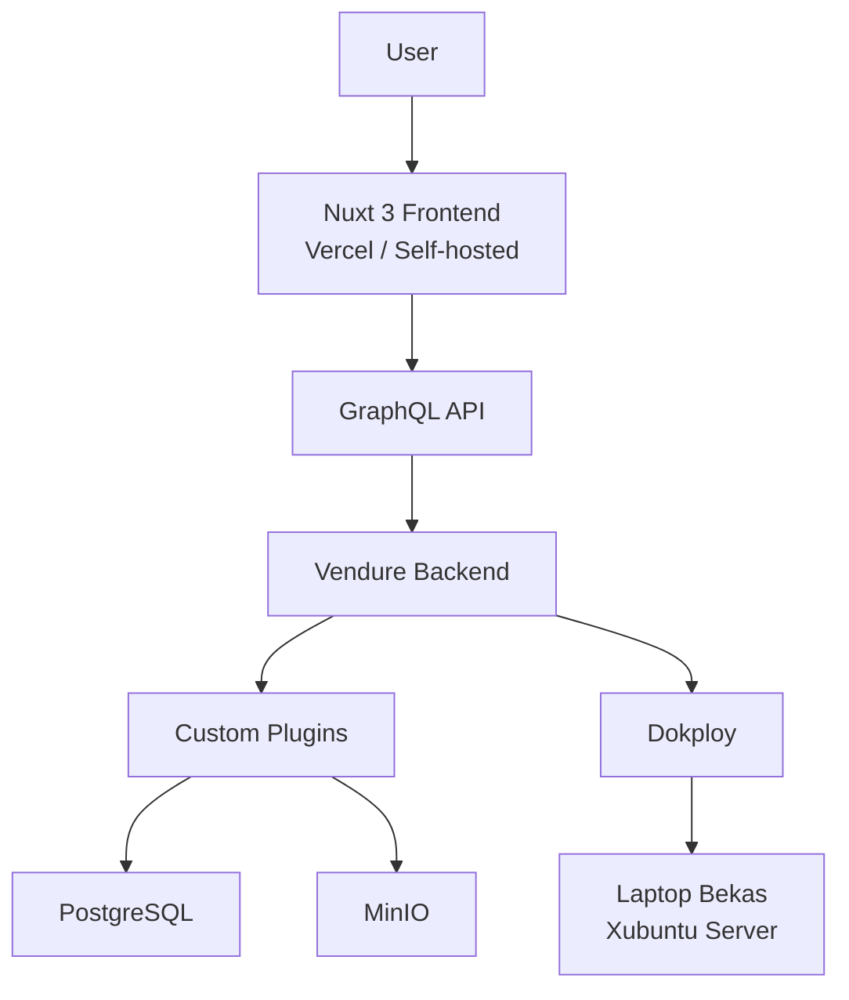

# Technical Architecture Document
## NgopiCode - Platform E-Commerce Digital Products

**Versi:** 1.0  
**Tanggal:** 28 Mei 2026  
**Status:** Draft  
**Tech Stack:** Vendure + Nuxt 3 + Dokploy  
**Hosting:** Self-hosted (Laptop Bekas)

---

## 1. Executive Summary

Dokumen ini menjelaskan arsitektur teknis dari **NgopiCode**, sebuah platform e-commerce yang menjual produk digital (source code, ebook, dan template) untuk developer Indonesia.

Platform ini dibangun dengan pendekatan **headless commerce** menggunakan **Vendure** sebagai backend dan **Nuxt 3** sebagai frontend. Deployment dilakukan secara self-hosted menggunakan **Dokploy** di atas laptop bekas dengan spesifikasi terbatas (8GB RAM + HDD).

Tujuan arsitektur ini adalah menciptakan sistem yang **maintainable**, **scalable secara bertahap**, dan **efisien** dalam penggunaan resource.

---

## 2. High-Level Architecture



**Komponen Utama:**
- **Frontend**: Nuxt 3 (bisa di Vercel atau self-hosted)
- **Backend**: Vendure (NestJS)
- **Deployment Platform**: Dokploy
- **Database**: PostgreSQL
- **File Storage**: MinIO
- **Hosting**: Laptop bekas (self-hosted)

---

## 3. Technology Stack

| Layer                | Teknologi                              | Versi     | Alasan Pemilihan |
|----------------------|----------------------------------------|-----------|------------------|
| **Backend Framework**| Vendure (NestJS + TypeScript)          | Latest    | Headless, extensible, GraphQL native |
| **Frontend**         | Nuxt 3 (Vue 3 + TypeScript)            | Latest    | Modern, performant, developer experience baik |
| **Database**         | PostgreSQL                             | 16+       | Default Vendure, reliable |
| **File Storage**     | MinIO                                  | Latest    | S3-compatible, self-hosted |
| **Deployment**       | Dokploy                                | Latest    | Ringan, cocok untuk hardware terbatas |
| **Containerization** | Docker + Docker Compose                | -         | Standard untuk self-hosting |
| **Reverse Proxy**    | Cloudflare Tunnel / Nginx              | -         | Aman dan mudah |
| **Payment Gateway**  | Tripay (Custom Plugin)                 | -         | Payment gateway lokal Indonesia |
| **Cache / Queue**    | Redis                                  | -         | Opsional di fase awal |

---

## 4. Component Architecture

### 4.1 Backend (Vendure)

- **Core**: Menggunakan architecture Vendure yang sudah modular.
- **Custom Development**:
  - `tripay-payment-plugin`: Integrasi pembayaran Tripay
  - `digital-fulfillment-plugin`: Logic untuk produk digital (file upload, license, secure download)
  - `email-plugin`: Notifikasi email setelah transaksi berhasil

Vendure akan dijalankan dalam dua proses:
- **Server** (API + Admin)
- **Worker** (Background jobs) — akan dioptimalkan karena keterbatasan RAM

### 4.2 Frontend (Nuxt 3)

- Menggunakan **GraphQL** untuk berkomunikasi dengan Vendure.
- Bisa di-deploy secara terpisah di **Vercel** (direkomendasikan) untuk performa lebih baik.
- Mendukung **PWA** agar bisa di-install di perangkat mobile.

### 4.3 File Storage

Menggunakan **MinIO** dengan struktur bucket:
- `products` → File utama produk digital
- `previews` → File preview yang bisa diakses publik

---

## 5. Data Architecture

### Entity Utama

- `Product` (dari Vendure)
- `ProductVariant` (untuk berbagai tipe lisensi)
- `DigitalProduct` (custom entity)
- `Order`
- `Customer`
- `DigitalDownload` (untuk tracking download)

### Storage Strategy

- Metadata produk → PostgreSQL
- File digital → MinIO
- Preview file → Bisa di MinIO atau public bucket

---

## 6. Deployment Architecture

### Infrastructure

- **Server**: Laptop bekas (Intel Core i3 + 8GB RAM + HDD)
- **OS**: Xubuntu Server
- **Orchestration**: Dokploy
- **Container Runtime**: Docker

### Service yang Dijalankan

| Service          | Resource Limit | Catatan |
|------------------|----------------|--------|
| Dokploy          | 512MB - 1GB    | Management UI |
| Vendure Server   | 1GB            | API + Admin |
| Vendure Worker   | 512MB          | Background job (bisa dinonaktifkan dulu) |
| PostgreSQL       | 1GB            | Database utama |
| MinIO            | 512MB          | File storage |
| Redis            | 256MB          | Opsional |

**Catatan**: Karena RAM hanya 8GB, **Redis tidak akan dijalankan di fase MVP**.

---

## 7. Integration Architecture

### Payment Integration (Tripay)

- Dibuat sebagai **Custom Payment Provider** di Vendure.
- Flow:
  1. Customer checkout → Buat transaksi di Tripay
  2. Tripay mengirim webhook ke endpoint Vendure
  3. Setelah status `PAID` → Trigger fulfillment

### Email Integration

- Menggunakan service seperti Resend atau Mailgun.
- Trigger email setelah order berhasil.

---

## 8. Security Architecture

- **Authentication**: Vendure built-in (JWT)
- **Download Protection**: Menggunakan signed URL + expiry time
- **File Access**: MinIO private bucket + pre-signed URL
- **API Security**: Rate limiting + input validation
- **Infrastructure**: Cloudflare Tunnel untuk expose domain

---

## 9. Scalability & Performance

### Saat Ini (Hardware Terbatas)

- Fokus pada **efisiensi resource**
- Menghindari proses yang tidak perlu (Worker, Redis)
- Frontend di-host di Vercel jika memungkinkan

### Rencana Scale ke Depan

1. Upgrade storage ke SSD
2. Tambah RAM menjadi 16GB
3. Aktifkan Redis
4. Jalankan Vendure Worker
5. Migrasi ke VPS / Mini PC yang lebih kuat

---

## 10. Future Considerations

### Mobile Application (Flutter)

- Akan mengkonsumsi **GraphQL API** yang sama dari Vendure.
- Perlu penambahan:
  - Deep linking
  - Push notification (Firebase)
  - Offline download management

---

## 11. Directory Structure (Proposed)

```
ngopicode/
├── backend/                  # Vendure Project
│   ├── src/
│   │   ├── plugins/
│   │   │   ├── tripay-payment/
│   │   │   └── digital-fulfillment/
│   │   └── migrations/
│   └── docker-compose.yml
├── frontend/                 # Nuxt 3 Project
│   ├── app/
│   └── components/
├── infrastructure/
│   └── dokploy/              # Konfigurasi Dokploy
└── docs/
    ├── PRD.md
    └── Technical-Architecture.md
```

---

## 12. Technology Decisions & Rationale

| Keputusan                    | Alasan |
|-----------------------------|--------|
| Menggunakan **Vendure**     | Headless, extensible, cocok untuk custom digital products |
| Menggunakan **Dokploy**     | Lebih ringan dibanding Coolify, cocok untuk 8GB RAM |
| **Nuxt 3** di Vercel        | Performa lebih baik + mengurangi beban server |
| **MinIO**                   | Self-hosted & S3 compatible |
| **Tidak pakai Redis di awal** | Menghemat resource di hardware terbatas |

---

## 13. Monitoring & Logging

- Monitoring dasar menggunakan fitur yang tersedia di **Dokploy**
- Log aplikasi diakses via `docker logs`
- Backup database dilakukan secara manual / script cron

---

**Dokumen ini dapat diperbarui seiring perkembangan project.**
